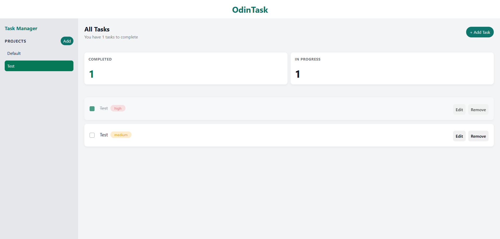

# Todo List

A simple task management app built with vanilla JavaScript and Webpack as part of The Odin Project curriculum. It lets you create projects, add tasks, edit them, mark them complete, and track task progress in a clean dashboard.



## Live Preview

Visit the app here: https://todo-list-omega-lemon.vercel.app/

## Features

- Create and switch between projects
- Add, edit, and remove tasks
- Mark tasks as complete or in progress
- View task counts and completion summaries
- Persist data in the browser with local storage

## Tech Stack

- JavaScript (ES modules)
- Webpack 5
- HTML Webpack Plugin
- CSS

## Getting Started

1. Install dependencies:
   ```bash
   npm install
   ```
2. Start the development server:
   ```bash
   npm run dev
   ```
3. Open the local development URL shown by Webpack.

## Build for Production

```bash
npm run build
```

## Project Structure

```text
src/
  index.html
  index.js
  styles.css
  modules/
    project.js
    todo.js
```

## Notes

- Project data is saved in browser local storage, so it remains available on refresh.
- The app is designed as a small front-end practice project and can be expanded with features like filtering, drag-and-drop, or due-date reminders.
